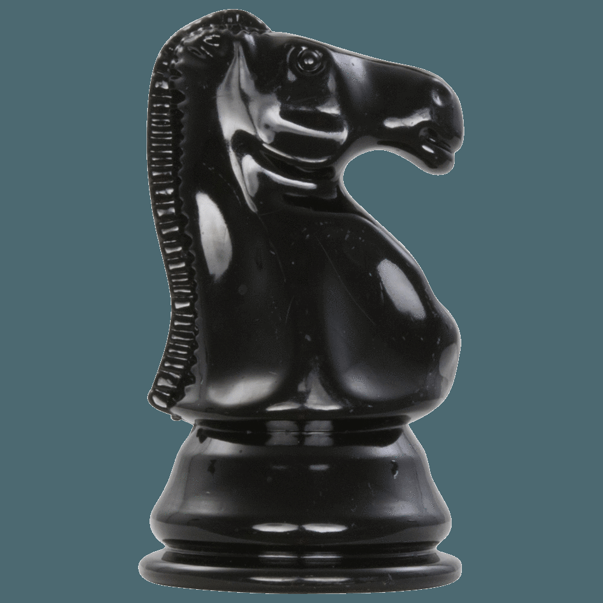

# An Chess Piece Identifier Using AutoML with CreateML

**Individual Project Two: Create an AutoML Solution**

In this project, I created an AutoML solution that uses Apple's AutoML toolkit [CreateML](https://developer.apple.com/machine-learning/create-ml/) to train a model that can identify chess pieces (Pawn, Rook, Knight, Bishop, Queen, and King) from images. The model is then used to predict the chess pieces from a given image.

### Dataset
The dataset used in this project is from [Kaggle](https://www.kaggle.com/niteshfre/chessman-image-dataset). The dataset contains 556 images of all 6 chess pieces (Pawn, Rook, Knight, Bishop, Queen, and King) in JPG format. The images are either 2D images or 3D photos of real chess pieces with various backgrouds.

Here is an example image that represents a Pawn in 2D format (left) and an example image that represents a Knight in 3D format (right):
<table>
  <tr>
    <td></td>
    <td></td>
  </tr>
</table>