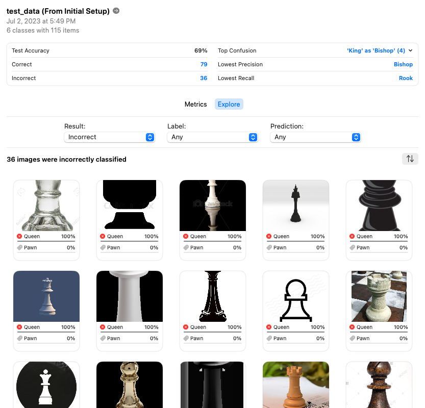

# An Chess Piece Identifier Using AutoML with CreateML

**Individual Project Two: Create an AutoML Solution**

In this project, I created an AutoML solution that uses Apple's AutoML toolkit [CreateML](https://developer.apple.com/machine-learning/create-ml/) to train a model that can identify chess pieces (Pawn, Rook, Knight, Bishop, Queen, and King) from images. The model is then used to predict the chess pieces from a given image.

### Dataset
The dataset used in this project is from [Kaggle](https://www.kaggle.com/niteshfre/chessman-image-dataset). The dataset contains 556 images of all 6 chess pieces (Pawn, Rook, Knight, Bishop, Queen, and King) in JPG format. The images are either 2D images or 3D photos of real chess pieces with various backgrouds.

Here is an example image that represents a Pawn in 2D format (left) and an example image that represents a Knight in 3D format (right):
<table>
  <tr>
    <td></td>
    <td></td>
  </tr>
</table>

### Setup (Manually)
- Clone this repository to your workplace
  - ```
    git clone https://github.com/CanYouTeachMeHowToCode/AutoML-With-CreateML
    ```
- Download the dataset from [Kaggle](https://www.kaggle.com/niteshfre/chessman-image-dataset) and unzip the file.
- Rename the unzipped folder to `data` (default) or your preferred directory name   `source_dir_path`.

- Run command 
  ```
  python scripts/process.py
  ```
  To setup the dataset for training and testing with default settings (80% training and 20% testing).

  Or run command 
  ```
  python scripts/process.py --source [source_dir_path] --dest-train [destination_train_dir_path] --dest-test [destination_test_dir_path] --ratio [ratio]
  ```
  To customize source and destination directories and train-test split ratio. Make sure that the `source_dir_path` is the same as the unzipped folder name.

### Model Training & Evaluation 
- Model 1
  - Model Settings
    
  - Model Training/Validation
    
  - Model Evaluation
    

- Model 1
  - Model Settings
    
  - Model Training/Validation
    
  - Model Evaluation
    

- Model 2
  - Model Settings
    
  - Model Training/Validation
    
  - Model Evaluation
    

- Model 3
  - Model Settings
    
  - Model Training/Validation
    
  - Model Evaluation
    

- Model 4
  - Model Settings
    
  - Model Training/Validation
    
  - Model Evaluation
    

### Model Prediction
Based on the evaluation results, Model 3 has the best performance. Therefore, Model 3 is used to predict the chess pieces from a given image.

Here are the prediction results for a few examples piece images:
<table>
  <tr>
    <td></td>
  </tr>
  </tr>
    <td></td>
  </tr>
  <tr>
    <td></td>
  </tr>
  </tr>
    <td></td>
  </tr>

</table>

### Conclusion
From the prediction results and the evaluation results above, we can figure out that the models serves well for most chess piece images, yet it may confuse on images of similar pieces like pawn, bishop, and queen.

### References
- [CreateML Recipe](https://github.com/noahgift/Apple-CreateML-AutoML-Recipes/tree/main)